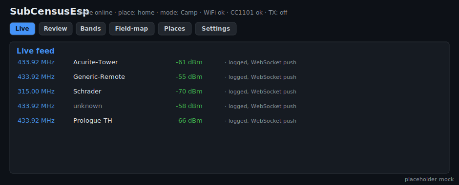
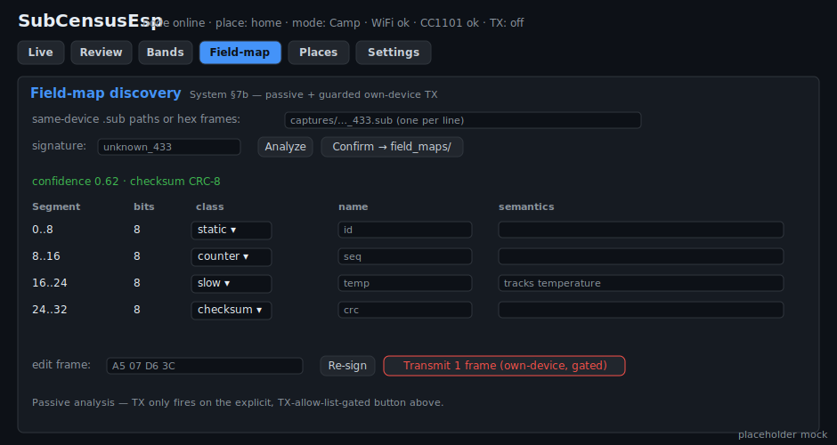
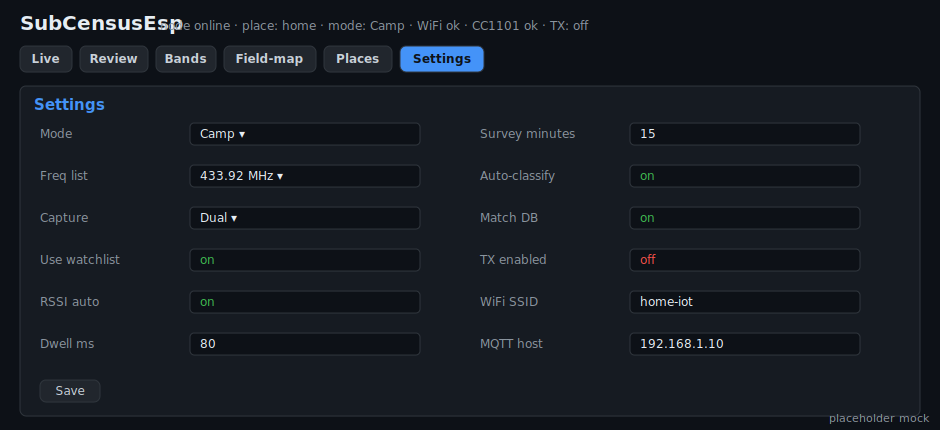

# SubCensusEsp — ESP32 + CC1101 node

> ⚡ **[Flash it from your browser →](https://jamesdavid.github.io/SubCensus/)** (one click, no
> toolchain — Chrome/Edge). Wiring diagram + pin map included. Source: [`flasher/`](./flasher/).

The cheap, always-on, **networked** narrowband node. Same **CC1101** as the Zero, so it
inherits the Zero's capture model and produces **identical feature vectors** (System §7) — the
cleanest fingerprint parity of the three sensors. Headless: review/label/config happen in a
browser over WiFi. Spec: [`../docs/SubCensusEsp_Spec.md`](../docs/SubCensusEsp_Spec.md); shared
contract: [`../docs/SubCensus_System.md`](../docs/SubCensus_System.md). See [`CLAUDE.md`](./CLAUDE.md).

## Flash it from your browser

No toolchain needed — a one-click **web flasher** (ESP Web Tools / Web Serial) lives in
[`flasher/`](./flasher/) and deploys to GitHub Pages via CI. Once Pages is enabled
(Settings → Pages → Source: GitHub Actions), open **https://jamesdavid.github.io/SubCensus/**
in Chrome/Edge, wire the CC1101 (diagram + pin map on the page), and click Install. See
[`flasher/README.md`](./flasher/README.md).

## Build (PlatformIO)

Platform pinned to `espressif32 @ 6.5.0` (Arduino core 2.0.x) for a reliable framework fetch.

```
pip install platformio
cd esp
python -m platformio run -e esp32dev            # compile-check (no device)
python -m platformio run -e esp32dev -t buildfs # pack the LittleFS data/ web UI
python -m platformio run -e esp32dev -t upload  # flash firmware over USB (or OTA once on WiFi)
python -m platformio run -e esp32dev -t uploadfs# flash the LittleFS image (web UI)
python -m platformio device monitor             # ESP_LOG / Serial
```

`shared/core` is compiled into the firmware via `src/subcensus_core.c` (unity build) and
exposed with `build_flags = -I../shared/core` — CONFIRMED linking. The core is float-only
(suits the ESP32 FPU).

## Hardware (Esp §2)

CC1101 on the VSPI bus: **SCK 18, MOSI 23, MISO 19, CS 5**; **GDO0 34** (input-only → RMT edge
capture), GDO2 35; optional SD CS 13. 3.3 V logic — no level shifter. Capture (RMT + CC1101) is
pinned to one core, WiFi/web to the other.

## Web UI + API (headless — the UI replaces the screen)

The ESP has no display; its UI **is** a tabbed single page served from LittleFS
`data/index.html` (self-contained, no CDN). Browse to the node's IP after it joins WiFi. The
header shows the node status (version · place · mode · WiFi · CC1101 · **TX enabled**). A top nav
switches tabs:





> Mockups of the tabbed UI (`data/index.html`), regenerated by `python docs/make_web_mockups.py`
> — swap for real browser screenshots of a flashed node any time.

- **Live** — the WebSocket capture stream: each hit appears as `freq · model/unknown · RSSI` the
  moment it's logged, so you can watch activity in real time.
- **Review / label** — the `census_log` table with the top classification **candidates** per row;
  a **label** button assigns a `device_class` (accept a candidate or pick from the taxonomy),
  which writes the label **and** appends the feature vector to the global brain
  (confirm-appends-fingerprint, System §6).
- **Bands** — the recon surface: **Run (accumulate)** / **Run (fresh)** / **Reset (keep pins)** /
  **Reset (wipe pins)** (System §9), then the ranked occupancy heatmap + derived watchlist with
  per-entry **pin / exclude**.
- **Field-map** (System §7b) — reverse-engineer an unknown: paste same-device `.sub` paths or hex
  frames + a signature and press **Analyze** → a **differential overlay** proposes byte segments
  (each row's **class / name / semantics** editable) with a corpus-discovered checksum; **Confirm
  → field_maps/** writes the user-confirmed `.fmap` entry (never auto-committed). The edit box +
  **Re-sign** recompute the checksum, and **Transmit 1 frame** rides the guarded, TX-allow-list-
  gated single-frame path for **own-device active confirmation** (off unless *TX enabled*).
- **Places** — list / create / switch the active place (each keeps its own occupancy/watchlist/
  census_log; the brain is global).
- **Settings** — a form for Mode, Freq list, Capture preset (incl. Dual), Use-watchlist, RSSI
  auto/threshold, Dwell, Capture-max, Survey minutes, Auto-classify, Match-DB, **TX enabled**,
  and WiFi/MQTT credentials; **Save** persists to NVS/LittleFS.

**JSON API** (everything scriptable): `/api/status`, `/api/captures`, `/api/candidates`,
`/api/label`, `/api/occupancy`, `/api/watchlist`, `/api/recon`, `/api/sweep`, `/api/camp`,
`/api/settings`, `/api/places`, `/api/place`, `/api/brain/sync`, the field-map endpoints
(`/api/fieldmap`, `/api/fieldmap/confirm`, `/api/fieldmap/resign`, `/api/fieldmap/tx`,
`/api/fieldmaps`), and the fixture-inject `/api/debug/inject` — which drives the full
decode→classify→log→WS path with **no live RF** (Esp §3.4), so you can exercise the whole UI
against a flashed node before any antenna work.

## Storage (Esp §4)

LittleFS default (`signatures/` global brain, per-place `census_log.csv`/`occupancy.csv`/
`watchlist.csv`, capped/rotating RAW captures). Same on-disk schema as the Zero/Pi (System §4/§9).
Optional SD (full per-place folder model) is a later, *optional* milestone.

## Tests (no hardware — an ESP32 can't run headlessly here)

```
# shared/core + ESP hardware-independent logic (settings, place, capture-decode, census_log,
# rotation, occupancy CSV, fingerprints, mqtt) — native, via zig cc
python esp/test/run_tests.py                # 8 test files

# web-UI driver contract (status/captures/candidates/settings/places/WS against the served shape)
python -m pytest esp/tools/                 # 7 tests
```

`esp/tools/esp_web.py` also has a `NodeClient` (httpx/WebSocket) to drive a **real** node
(USB/OTA) and fixture-inject over `/api/debug/inject`. Live radio (RMT capture, CC1101 RSSI/TX),
live WiFi/MQTT/OTA, and browser rendering are on-device steps (`TODO(hw)`).

## Status

**All milestones complete (M1–M8), spec-delta zero:**
- **M1** skeleton (WiFi/NTP/web/CC1101/settings/place) · **M2** RMT capture + Camp + census_log +
  rotation + WebSocket feed · **M3** Recon+Sweep → occupancy/watchlist (**accumulate/fresh + user
  pin/exclude preservation**, System §9) · **M4** classification (feature vector + gated k-NN) +
  confirm-appends-fingerprint · **M5** web UI complete · **M6** SD auto-detect → full per-place
  folder model (LittleFS fallback with rotation) · **M7** MQTT/HA discovery + brain sync + OTA ·
  **M8** replay + edit-before-transmit + **in-browser field-map discovery** (CC1101 TX; opt-in,
  TX-allow-list gated, single-frame): passive differential overlay + segment labeling
  (`sc_diff`/`sc_fieldmap`), corpus checksum discovery, confirm-write a `field_maps/*.fmap` entry,
  checksum re-sign, and guarded own-device active confirmation via `/api/fieldmap/tx`.

Tested with **11 native (`zig cc`) + 10 web-driver** tests; `pio run` compiles clean (79.6%
flash). Live radio (RMT capture, CC1101 RSSI/TX), live WiFi/MQTT/OTA, and SD reads are on-device
steps (`TODO(hw)`); everything upstream is covered by the native + web-driver tests.
