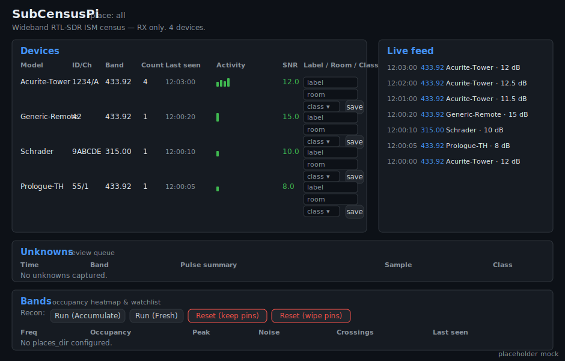

# SubCensusPi — RTL-SDR / Raspberry Pi

The stationary, run-it-for-a-week counterpart to the Zero. Wideband: decodes hundreds of ISM
device protocols via `rtl_433`, logs everything continuously to SQLite, captures the
undecodable for later classification, and surfaces it in a small FastAPI dashboard with
MQTT → Home Assistant discovery. **RX-only.** Spec:
[`../docs/SubCensusPi_Spec.md`](../docs/SubCensusPi_Spec.md); shared contract:
[`../docs/SubCensus_System.md`](../docs/SubCensus_System.md).

## Install

**Quick install (Raspberry Pi OS / Debian / Ubuntu)** — installs rtl_433 + RTL-SDR, clones the
repo, sets up a venv, and seeds `config.yaml`:

```
curl -sSL https://raw.githubusercontent.com/JamesDavid/SubCensus/master/pi/install.sh | bash
```

Prefer to read it first (recommended for any `curl | bash`): `curl -sSL <same-url> -o install.sh`,
inspect [`pi/install.sh`](./install.sh), then `bash install.sh`. Override the target dir with
`SUBCENSUS_DIR=/opt/subcensus`.

**Manual install** (already have the repo):

```
cd pi
pip install -e .[dev]        # fastapi, uvicorn, jinja2, python-multipart, paho-mqtt, pyyaml (+ pytest, httpx)
# system: rtl-433 (or build from source) + a current librtlsdr (needed for RTL-SDR Blog v4)
```

## Run

**One process owns the radio: the dashboard.** It switches the single dongle between three
mutually-exclusive modes — **off**, **decode** (the rtl_433 census), and **spectrum** (a live
rtl_power waterfall) — from the **Capture** control in the browser. There is no separate
collector process to run or fight over the dongle; decode runs as a managed subprocess inside
the web app.

```
# the dashboard (owns the radio). Point it at the catalog, place dir, decode config, and the
# file that remembers the selected mode across reboots.
SUBCENSUSPI_DB=/tmp/census.db \
SUBCENSUSPI_PLACES_DIR=/var/lib/subcensuspi/places \
SUBCENSUSPI_CONFIG=config.yaml \
SUBCENSUSPI_RADIO_STATE=/tmp/radio_state.json \
    uvicorn subcensuspi.web.app:app --host 0.0.0.0 --port 8080
# -> open http://<host>:8080/ and pick Decode or Live spectrum in the Capture control.

# no hardware: drive the full decode -> catalog -> SQLite path from recorded rtl_433 JSON.
# (This is the same collector CLI the dashboard's Decode mode launches for you.)
python -m subcensuspi.collector.main --config config.example.yaml \
    --replay ../test/fixtures/rtl433/home_stream.jsonl --db /tmp/census.db
```

Config is `config.example.yaml` (Pi §8): dongles (single-hop or multi-dongle by serial),
`place`, `places_dir`, global `signatures_dir`, `iq_dir` + `max_iq_gb` disk guard, MQTT/HA,
web host/port, and opt-in `prioritize_watchlist` (reorder hop/dongle attention by the place
watchlist, §3). **One** systemd service in production (Pi §9): `subcensuspi`.

### Run under systemd (Pi §9)

One unit lives in [`subcensuspi/systemd/`](./subcensuspi/systemd/): `subcensuspi.service` — the
uvicorn dashboard that owns the dongle and runs decode/spectrum on demand. It is
`Restart=always`; decode *additionally* relaunches a dead rtl_433 per-dongle with backoff
internally (Pi §9), so one failed dongle never restarts the others. The last-selected radio mode
is persisted (`SUBCENSUSPI_RADIO_STATE`) and re-applied on boot, so a headless Pi resumes
decoding by itself. Edit the `User=`/`WorkingDirectory=`/`ExecStart=`/`Environment=` lines to
match your install, then:

```
sudo cp subcensuspi/systemd/subcensuspi.service /etc/systemd/system/
sudo systemctl daemon-reload
sudo systemctl enable --now subcensuspi
```

(`pi/install.sh` does all of this for you, and removes any pre-refactor
`subcensuspi-collector`/`subcensuspi-web` units so they can't keep fighting for the dongle.)

### Export into the shared brain (Pi §10a)

Emit the Pi's `fingerprints.csv` + `protocol_map.csv` (via the shared brain writers) so
`build_signatures.py` can merge them with the Zero's labeled data:

```
python -m subcensuspi.brain_export --config config.yaml --out pi_export
# then merge (from the repo tools/):
python build_signatures.py --signatures-dir <signatures_dir> \
    --fingerprints pi_export/fingerprints.csv --protocol-map pi_export/protocol_map.csv
```

## Using the dashboard — section by section



> Mockup modelled from the real dashboard running against the fixture stream below — regenerate
> with `python docs/make_web_mockups.py`; swap for a browser screenshot any time.

Open `http://<host>:8080/`. It's a **single self-hosted page** (no external JS/CDN, works
offline), auto-refreshing on a poll. The header shows `place: <active>` and a device count.
Everything is **RX-only** — there is no transmit control anywhere in the UI.

- **Devices** (main table) — one row per grouped device: **Model · ID/Ch · Band · Count · Last
  seen · Activity · SNR · Label / Room / Class**. The **Activity** column is a unicode-block
  **sparkline** of that device's recent reception bins (straight from the SQLite event log), so
  you can see cadence at a glance. The **Label / Room / Class** cell has `label`/`room` inputs + a
  `device_class` dropdown and a **save** button — saving writes the catalog row **and** feeds the
  global active-learning brain (System §6). This is the everyday "identify what's around me" view.
- **Live feed** (right column) — the newest decoded events as they land (`time · freq · model ·
  SNR`, plus `room` when the device is labeled), newest first. Confirms the collector is hearing
  things without reloading.
- **Unknowns — review queue** — undecodable captures needing a human: **Time · Band · Pulse
  summary · Sample · Class**. **Sample** links to `inspect`/download the recorded IQ (`.cu8`) so
  you can eyeball or replay it in an external tool; you assign a class + notes or discard. (Shows
  "No unknowns captured" when the corpus is clean, as in the fixture above.)
- **Capture — one radio** (top bar) — the single control that owns the dongle. Buttons **Off** /
  **Decode** / **Live spectrum** plus a **band** select. **Decode** is the rtl_433 census (the 24/7
  default — populates Devices/Live feed/Unknowns); **Live spectrum** runs a continuous `rtl_power`
  waterfall on the chosen band. They are mutually exclusive (one radio) — switching stops the
  other automatically, and the chosen mode is remembered across reboots. Status shows what the
  radio is doing (and why it stopped, if a mode dies). Backed by `GET`/`POST /api/radio`.
- **Bands — occupancy heatmap & watchlist** — the recon surface. Pick a **band** (315/433/ISM/…)
  and press **▶ Live spectrum** for a continuous live sweep, or the **Recon** buttons — **Run
  (Accumulate)** / **Run (Fresh)** / **Reset (keep pins)** / **Reset (wipe pins)** — for a one-shot
  sweep that accumulates into `occupancy.csv` (System §9). Both run a **real `rtl_power` sweep on
  the dongle** (they take over the radio like the Capture control does). A canvas draws the
  **occupancy heatmap strip** (per-bin busy %) over a **sweep waterfall** (freq × time, newest on
  top). Below, the ranked `occupancy.csv` (**Freq · Occupancy · Peak · Noise · Crossings · Last
  seen**) and the derived `watchlist.csv` with per-entry **pin / exclude**. Needs `places_dir` set.

**Scripting / headless:** every view has a JSON endpoint — `GET /api/radio` (+ `POST` to switch
mode), `GET /api/spectrum/live`, `GET /api/devices`, `/api/device/{id}/activity` (sparkline bins),
`/api/occupancy`, `/api/watchlist`, `/api/unknown/{id}/inspect` (+ `/iq`); `POST /api/label`,
`/api/recon`, `/api/watchlist/pin`.

**Places, field-maps, and LLM analysis are not web tabs** (they're not per-session UI): the active
place is set in `config.yaml` (`place:`); field-map discovery runs passively over the events
corpus with `python -m subcensuspi.fieldmap` (System §7b, RX-only — labeling, no active confirm);
and `export_place` / `analyze_place` produce the analysis bundle + `analysis.json`/`.md` offline.

## Architecture

```
subcensuspi/
  dsp/             Python port of shared/core — PARITY-LOCKED to the C golden fixtures
                   (sub, pulse, feature §7, cadence §7a, knn §6, crc + diff §7b, occupancy §9)
  db.py            SQLite catalog (devices/events/unknowns, WAL, place-scoped) — Pi §5
  config.py        YAML config (Pi §8)
  collector/       parser, Collector (fixture-drivable), multi-dongle runner, rtl433 launcher
  web/             FastAPI dashboard + JSON API + WebSocket-less live poll (Pi §7)
  occupancy_pass.py  rtl_power sweep -> shared-schema occupancy.csv/watchlist.csv (Pi §3, §9a)
  mqtt.py          MQTT -> Home Assistant discovery (Pi §9)
  brain_export.py  emit protocol_map/fingerprints into the shared brain (Pi §10a)
  export_place.py  roll a place -> shared analysis bundle + prompt.md (System §8)
  analyze_place.py provider-agnostic structured analysis (default local; System §8)
  fieldmap.py      passive field-map discovery over the events corpus (System §7b) — RX-only
```

## Cross-tool parity (important)

`subcensuspi/dsp/` reimplements `shared/core` in Python and is **parity-locked**:
`tests/test_dsp_parity.py` loads the SAME `test/fixtures/` and asserts the SAME golden values
the C tests assert. Emitted `occupancy.csv`/`watchlist.csv`/`fingerprints.csv` are validated
against the SAME `shared/schema/`. So a Zero place and a Pi place are interchangeable (System §7/§9a).

## Tests (no hardware)

```
cd pi && python -m pytest         # 85 tests: DSP parity, collector, dashboard (sparklines,
                                  # unknowns inspect, Bands), multi-dongle, unknowns, MQTT,
                                  # occupancy pass, shared brain, Places, field-map
```

rtl_433 is driven from **recorded JSON** fixtures (no dongle, no rtl_433 binary needed);
`rtl_433 -r <fixture.cu8>` is supported when the binary is present. Dashboard via httpx;
MQTT via a fake broker. Only live dongle behaviour (gain/ppm/reception) and `rtl_power`
sweeps need hardware (`TODO(hw)`).

## Status

**Complete — M0–M9** (all Pi §11 milestones), spec-delta zero. 85 tests green.
