# SubCensusZero — Flipper Zero FAP

Portable narrowband (CC1101) ISM survey + logger. Passive Recon/Sweep/Camp monitoring,
capture to standard `.sub` files with a persistent catalog + on-device label workflow, and
**replay-to-identify** (the only TX path — explicit, manual, TX-allow-list gated). Spec:
[`../docs/SubCensusZero_Spec.md`](../docs/SubCensusZero_Spec.md); shared contract:
[`../docs/SubCensus_System.md`](../docs/SubCensus_System.md).

## Build (ufbt)

Pinned to the **official release** SDK channel (stock firmware) — see [`../CLAUDE.md`](../CLAUDE.md).

```
pip install ufbt
ufbt update                 # release channel (SDK 1.4.3, API 87.1, target f7)
cd zero
python -m ufbt              # build subcensuszero.fap  (dist/subcensuszero.fap)
python -m ufbt lint         # clang-format check
python -m ufbt launch       # deploy over USB, or copy the .fap to the SD /apps/Sub-GHz/
```

If your device runs Unleashed/Momentum, re-pin the SDK to that firmware (subghz symbol
names differ) and re-verify.

## Using it — screen by screen

> The images below are **placeholder mockups** (`docs/screens/*.svg`), modelled from the scene
> draw code — not real device captures. Regenerate with `python zero/docs/make_screens.py`.
> Replace each with a real qFlipper screenshot (same filename) once hardware is available.

The intended flow is a **pipeline**: **Recon** once to learn what's active here → it writes a
watchlist → **Sweep/Camp** monitor using it → **Review** to label captures → optionally **Edit**
to replay/identify or reverse-engineer. Everything writes under the active **Place**.

### Main menu

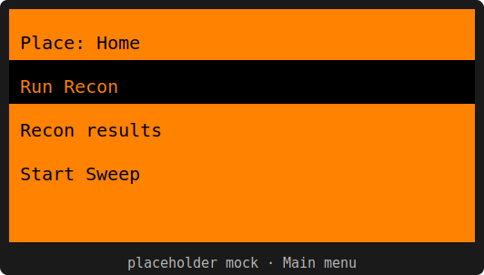

The active **Place** is shown at the top (tap to switch/manage). Up/Down move, **OK** selects,
**Back** exits. Items: **Run Recon · Recon results · Start Sweep · Start Camp · Review captures ·
Settings · About**. Monitoring items are disabled (routed to the SD screen) if the card is out.

### Settings (§4)

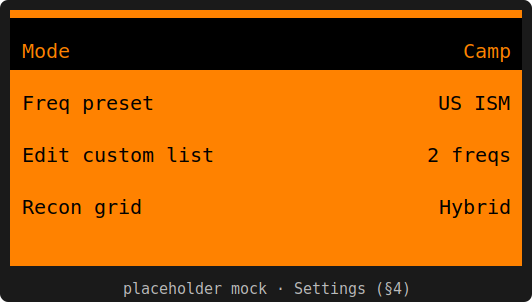

A `VariableItemList`: **Left/Right** change a value, **OK** on *Edit custom list* opens the
frequency editor. Covers Mode, Freq preset (US/EU/**Custom**), Camp freq, Recon grid/step, Survey
minutes, RSSI threshold (or **Auto**), Capture preset (incl. **Dual**), Dwell, Capture-max,
Signal-end gap, Min-gap, Auto-classify, Match-DB, Notify. Saved on **Back**.

### Places

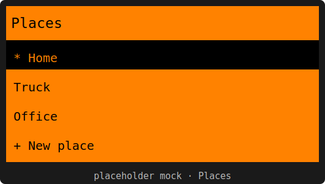

The active place is marked `*`. Create (text-input name), Rename, Delete (confirm — removes the
place folder only, never the global `signatures/`), or Set active. Each place keeps its own
occupancy/watchlist/census_log/captures; the brain is global.

### Recon (discovery)

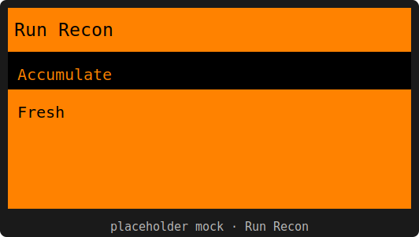

Run Recon first prompts **Accumulate** (default — merges into this place's occupancy so coverage
improves each pass) or **Fresh** (clears first). Then the live "surfing" view opens:

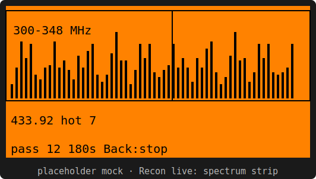 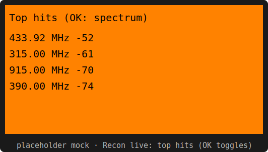

**Top pane** — a spectrum/activity strip (RSSI bars across the segment being swept, peak-hold-with-
decay, a cursor at the current sample) that **auto-follows** the sweep across the CC1101 segments
(300–348 / 387–464 / 779–928 MHz). **Left/Right** page a segment manually; **OK** toggles to a live
**top-hits** mini-list. **Bottom pane** — segment · freq · hot-bin count · pass · elapsed (always
visible). **Back** stops. On completion it writes `occupancy.csv` + `watchlist.csv` and opens:

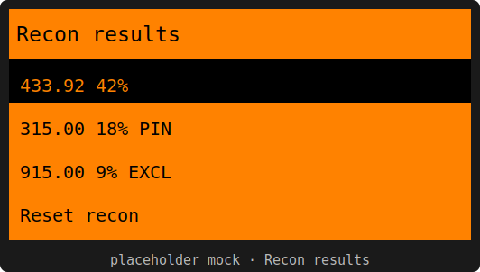 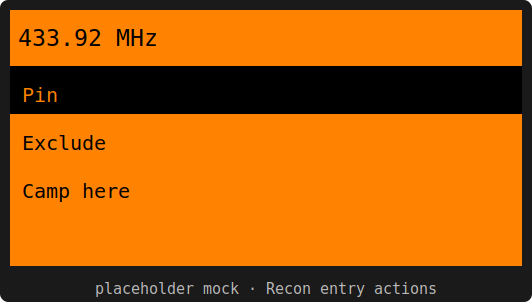 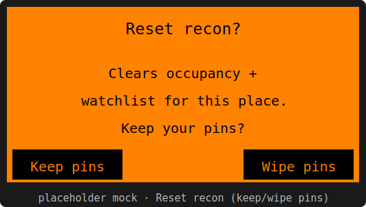

**Recon results** ranks the watchlist (freq · occupancy% · PIN/EXCL tag). Select an entry for
**Pin / Exclude / Camp-here**; pins/exclusions persist across re-runs. **Reset recon** is
confirm-gated and prompts **Keep pins / Wipe pins** (touches recon artifacts only). Empty place →
a "No recon — Run Recon" shortcut.

### Sweep & Camp (monitor)

**Start Camp** first opens the frequency picker; **Start Sweep** cycles the watchlist (or the
preset/custom list) and — with no recon — shows a dismissable hint first:

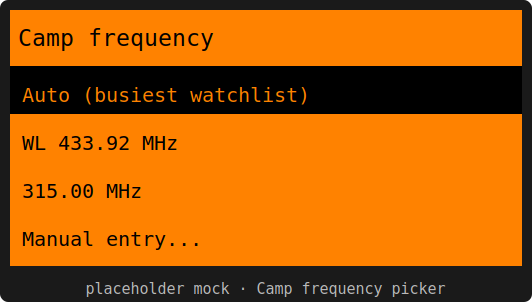 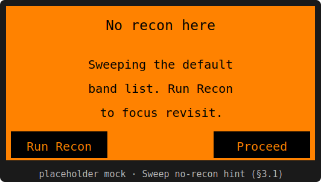

The **Camp picker** offers **Auto (busiest watchlist)** · watchlist hot-bins · allowed presets ·
**Manual entry** (a number-entry validated against the RX allow-list). Auto is greyed with no
watchlist. Then the shared live view runs:

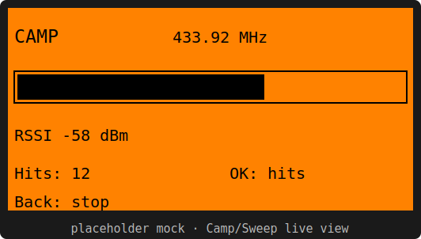 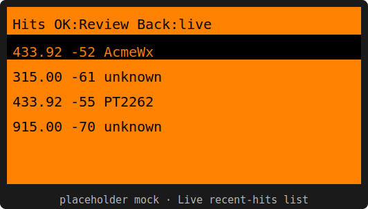

CAMP/SWEEP header, frequency, an **RSSI bar**, and a hits counter; each capture flashes the LED
(and vibro, per Settings). **OK** toggles the **recent-hits list** — Up/Down scroll, **OK on a row
jumps to that capture in Review** (the worker keeps running), **Back** returns to the live view.
Monitoring is **passive** — it never transmits. If the SD runs low, captures pause to RSSI-only
"blip" rows and an **SD LOW** banner shows.

### Review & labeling

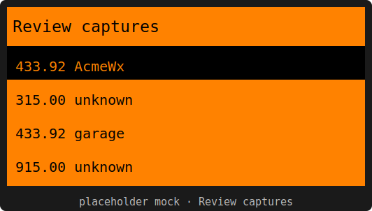 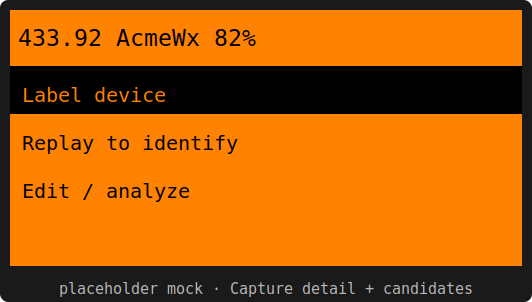 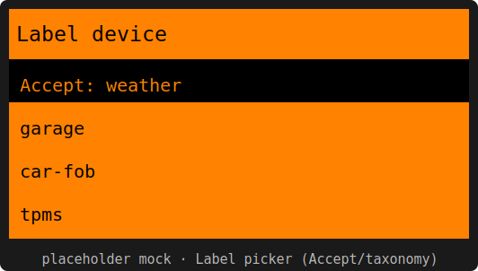

**Review captures** lists `census_log` rows (freq · match/label). The **detail** view recomputes
the feature vector from the `.sub`, runs gated k-NN against the brain, and shows the top candidate
+ confidence, with **Label device · Replay to identify · Edit / analyze**. The **label picker**
lets you **Accept** the candidate or pick from the shared taxonomy — it writes the `label` column
in place **and** appends the vector to the global `fingerprints.csv` (`source=user`, the
active-learning loop).

### Replay & the M10 editor (the only TX path)

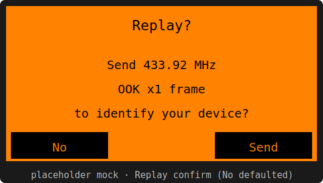 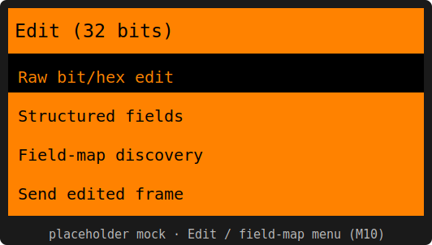

**Replay to identify** re-transmits your own capture on its stored freq/preset — **confirm-gated
with No defaulted**, showing freq + preset, and greyed if the firmware TX allow-list forbids the
band. **Edit / analyze** opens the M10 editor menu:

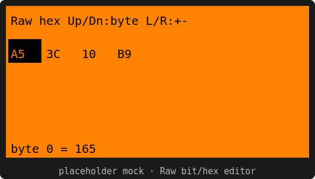 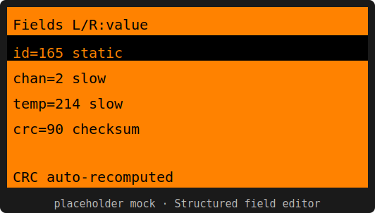 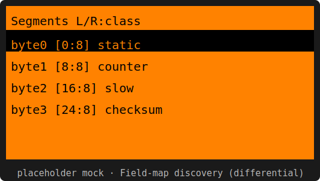

- **Raw bit/hex edit** — the frame as hex; Up/Down pick a byte, Left/Right adjust it.
- **Structured fields** (known protocol) — labeled fields from the field-map; Left/Right change a
  field's value and the **checksum is recomputed** automatically. A decode-back gate blocks a Send
  that doesn't re-decode cleanly.
- **Field-map discovery** (unknowns) — seeds a proposed structure from the passive **differential**
  analysis over the same-device capture corpus; Left/Right relabel each segment's class. **Propose
  field-map** writes a `signatures/field_maps/<proto>.fmap` entry (you confirm — never
  auto-committed). **Send edited frame** rides the same guarded single-frame TX path for
  **own-device active confirmation** and is logged distinctly in `edits_log.csv`.

### About & SD states

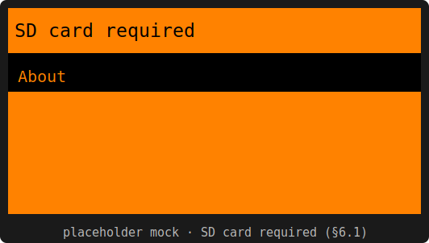 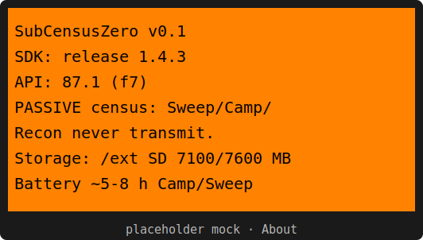

With no SD card the app shows a blocking **SD card required** screen (About still reachable) and
auto-recovers when a card is inserted. **About** shows the app version, the SDK/API it was built
against, the passive-monitoring note, storage tier + free space, and the expected battery drain.

## Generated files (do not hand-edit)

`census_taxonomy.h` and `census_schema.h` are **generated** from `shared/taxonomy.yaml` +
`shared/schema/` (System §10). To change them, edit the source in `shared/` then:

```
python -m subcensus_tools.codegen     # from tools/  (writes the headers)
cd zero && python -m ufbt format      # clang-format the generated output
```

`codegen --check` (content-based) guards against drift; `ufbt lint` guards formatting.

## shared/core in the FAP

`shared/core` is compiled into the FAP as a **unity build** via `subcensus_core.c` (fbt can't
reference `../` sources). It is `float`-only (Cortex-M4F is single-precision). File-scope
`static` names across core `.c` must be unique — shared helpers live in `shared/core/sc_util.h`.

## Layout

```
application.fam        appid subcensuszero, Sub-GHz category
subcensuszero.c        entry, view_dispatcher + scene_manager wiring
subcensuszero_i.h      app state
subcensus_core.c       unity build of shared/core into the FAP
census_storage.{c,h}   settings persistence + Places on-disk model (§4, §5.4, §5.6)
census_freq.{c,h}      frequency presets + allowed-frequency guard (§3.1, §7)
census_taxonomy.h      GENERATED from shared/taxonomy.yaml
census_schema.h        GENERATED from shared/schema/
scenes/                start / settings / places / place actions / text / confirm / about / todo
```

## On-disk layout (SD `/ext`)

```
/ext/apps_data/subcensuszero/
  config.settings                 # global settings + active place
  signatures/                     # GLOBAL brain (shared with the Pi/Esp)
  places/<place_id>/{place.meta, occupancy.csv, watchlist.csv, census_log.csv, captures/}
```

## Tests (no hardware)

The logic core is host-tested via `python test/core/run_tests.py` (repo root); the pure
allowed-frequency predicate has its own native test (`test_freq_bands.c`). Live RSSI /
capture / TX are on-device validation (`TODO(hw)`), not automated. The Flipper serial-RPC
harness (`tools/debug/flipper_*`) drives on-device UI once a Flipper is attached.

## Status

**All milestones complete (M0–M10), spec-delta zero:**
- **M0** Phase-0 prior-art + SDK pin (`docs/SubCensusZero_Phase0_Findings.md`) · **M1** skeleton
  (menu, **full §4 Settings**, Places, freq guard, About) · **M2** Camp capture engine
  (`census_worker`: async RX → feature vector → `.sub` + census_log + notify; live view with
  **recent-hits list → jump-to-Review**) · **M3** Sweep (watchlist-or-preset) · **M4** Recon
  (`census_recon`: hybrid/known/full grid → occupancy.csv + watchlist.csv; **auto-following
  spectrum strip** live view; **Recon results Pin/Exclude/Camp-here + Reset (keep/wipe pins)**) ·
  **M5** auto-classify (`SubGhzReceiver`/environment protocol tagging) · **M6** classification DB
  (`census_brain`: gated k-NN + confirm-appends-fingerprint) · **M7** Dual OOK/FSK with **real
  re-capture of the next occurrence under 2-FSK** (`fsk_suspected` + preset switch) · **M8** Review
  + on-device labeling (**in-place `census_log` label rewrite** + Accept-candidate) +
  replay-to-identify · **M9** host `export_place`/`analyze_place` accept a Zero place folder
  (`tools/`) · **M10** full edit-before-transmit / field-map discovery: **raw bit/hex editor**,
  **structured field editor** (field-map + checksum re-sign + decode-back gate), **differential-
  seeded segment labeling** on unknowns (`sc_diff` → `sc_fieldmap`), **Propose field-map**
  (`signatures/field_maps/*.fmap`, user-confirmed) and **own-device active confirmation** via the
  guarded single-frame edit-TX path (logged distinctly in `edits_log.csv`).

Also: the **Camp frequency picker** (Watchlist / presets / Manual entry / Auto=busiest), the
**Custom frequency-list editor**, and the **SD-required / SD-full** states (§6.1: blocking screen
+ auto-recover; low-space → RSSI-only blip rows + banner; free space in About) are all in.

Live RSSI / capture / TX are on-device (`TODO(hw)`); the processing they feed is `shared/core`
(native-tested — `sc_fieldmap` / `sc_slice` added for the editor) and the whole FAP compile-checks
+ lints clean under `ufbt`. A distributable brain seed lives in
[`../shared/signatures/`](../shared/signatures/).
